<h1>Compte rendu de l'activité Pratique N° 2 : ORM JPA HIbernate Spring Data Exemple de Roles et users</h1>
Grami salma 
<h3>Introduction</h3>

Dans ce TP sur les relations Many-to-Many, nous explorerons comment modéliser et gérer efficacement des associations complexes entre entités dans le cadre de Spring Boot. En utilisant des exemples pratiques, nous apprendrons à mettre en œuvre ces relations bidirectionnelles pour créer des applications robustes et bien structurées.

 
<h3>Enonce</h3>

Refaire l'exemple pour savoir comment se comporter avec l'asociation Many To many .

<h3>Conception</h3>
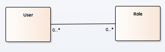

 

<h3>Captures ecran </h3>

Créer les entites  JPA Roles et users  dans H2 

Avec la relation Many-to-Many entre les entités Roles et Users, une classe d'association supplémentaire est introduite pour gérer cette relation. Cette classe d'association contient deux clés étrangères qui référencent les clés primaires des entités correspondantes (Roles et Users), ainsi qu'une clé primaire propre à la classe d'association. En résultat, cela crée une table d'association dans la base de données, permettant une liaison efficace entre les rôles et les utilisateurs. Cette approche offre une grande flexibilité, permettant à un utilisateur d'avoir plusieurs rôles et à un rôle d'être associé à plusieurs utilisateurs, ce qui est courant dans de nombreux systèmes d'authentification et d'autorisation. 

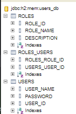

 
 

Creation de la table users avec quelques donnees 

 
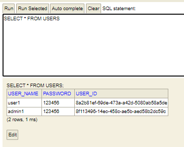

Le password doit etre crypte pour la securite des donnees 

  
Creation de la table roles avec quelques donnees 
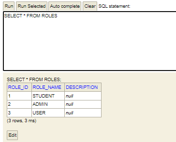
  

Creation de la table association resultante de la relation Man To Many entre Rles et users

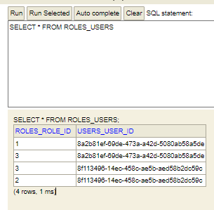
  

La classe UUID nous aide à générer des clés uniques selon le système, par exemple, lorsque nous utilisons UUID.randomUUID().toString() pour définir l'identifiant de chaque user avant de l'enregistrer dans la base de données en utilisant userRepository.save(User). Cela garantit l'unicité de chaque clé, ce qui est essentiel pour éviter les conflits d'identifiants dans notre système.

 
 

Migration vers Mysql

Pour effectuer cette migration nous changeons l'url et le port de connection dans le fichier propreties 

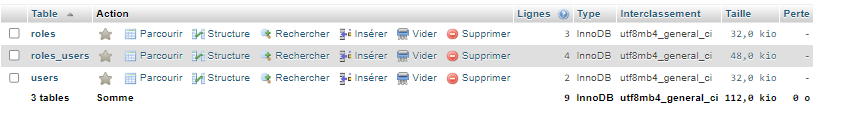
  
<h4>L'encryptage de password </h4>

Pour encoder le mot de passe, j'ai suivi plusieurs étapes. Tout d'abord, j'ai ajouté la dépendance `spring-security-crypto` dans mon fichier `pom.xml`. Ensuite, j'ai importé cette dépendance dans mon entité. J'ai également ajouté un encodeur BCrypt comme champ statique dans mon entité. Enfin, j'ai redéfini la méthode `setPassword` pour qu'elle encode le mot de passe avec l'encodeur BCrypt avant de le stocker. Cela garantit que le mot de passe est correctement crypté avant d'être enregistré en base de données, renforçant ainsi la sécurité de l'application.

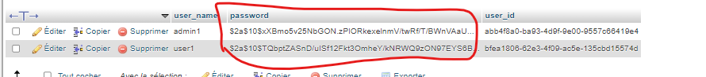

la table roles dans Mysql

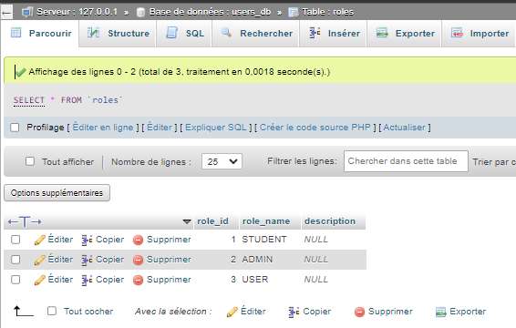

la table Role_User dans Mysql

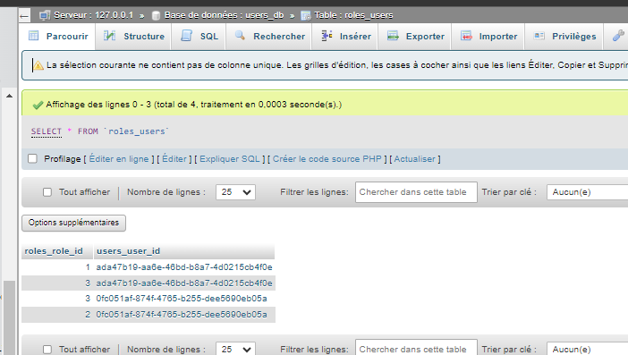

Afficher les donnees dans web service

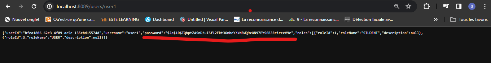
 
 
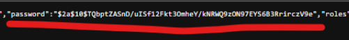

Pour éviter les boucles causées par les relations bidirectionnelles entre les tables, nous avons ajouté des restrictions telles que @JsonProperty(access=JsonProperty.Access.WRITE_ONLY). Par exemple, pour afficher un utilisateur avec sa liste de roles, nous utilisons une seule direction d'affichage, en excluant l'information redondante.

<h3>Conclusion</h3>

En conclusion, ce TP sur les relations Many-to-Many nous a permis de comprendre en profondeur la modélisation et la gestion des associations complexes entre entités dans Spring Boot. Grâce à des exercices pratiques, nous avons acquis les compétences nécessaires pour implémenter des relations bidirectionnelles efficaces, renforçant ainsi nos capacités à développer des applications Java robustes et bien structurées.
